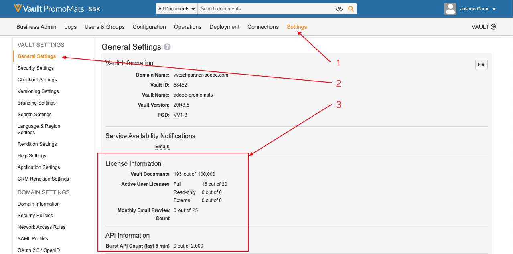

# Aanbevolen werkwijzen, instructies en berichten

## Versies

Voor deze integratie zijn minimaal de volgende softwareversies vereist:

* Adobe Experience Manager, 6.5.5+
* Veeva Vault PromoMats, 20R3.2+

## Gegevensprivacy

Deze integratie is ontworpen om inhoud over te brengen tussen Adobe Experience Manager en Veeva Vault PromoMats. Uw bedrijf is verantwoordelijk voor het naleven van de privacywetten en -regels die van toepassing zijn op het verzamelen en gebruiken van gegevens.

## Frequentie voor synchronisatie van inhoud

AEM inhoud en meta-gegevens wordt gesynchroniseerd van AEM aan VVPN wanneer het integratiewerkschema is teweeggebracht. Dit kan automatisch of handmatig worden gedaan. VVPM-metagegevens worden gesynchroniseerd van VVPM naar AEM. Dit kan automatisch door een planner of manueel door een knoop worden gedaan klikken.

## Integratiebeperkingen en beste praktijken en instructies

Houd rekening met de volgende beperkingen wanneer u deze integratie gebruikt:

* Alleen de volgende datatypen worden ondersteund bij het synchroniseren van metagegevens: &quot;Tekst&quot; en &quot;Meerdere regels tekst&quot;.
* Hoewel de integratie AEM modulaire inhoud (Content Fragments en Experience Fragments) steunt, steunt het geen modulaire inhoud VVPM.
* Aan VVPM gekoppelde documenten worden niet ondersteund.
* Het synchroniseren van visuele aantekeningen VVPM van VVPM aan AEM wordt niet gesteund.
* De integratie importeert geen inhoud van VVPM naar AEM.
* Metagegevensvalidatie wordt niet ondersteund.
* Het aantal documenten is beperkt op basis van de Veeva-licentie. Zie [ Beperkingen van de Vergunning ](#veeva-license-limitations).
* Het aantal API-aanroepen is beperkt op basis van de Veeva-licentie. Voor meer informatie zie [ API Beperkingen ](https://developer.veevavault.com/docs/#what-are-rate-limits). Zie [ Beperkingen van de Vergunning ](#veeva-license-limitations).

## Licentielimieten voor Veeva

U kunt uw instantielimieten controleren door aan de algemene montages te navigeren VVPM.

