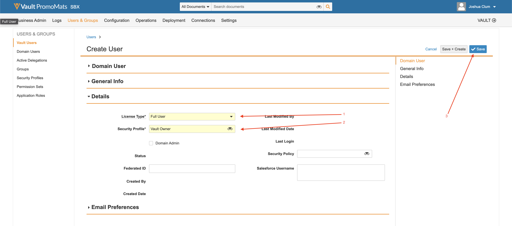

# Integratiegebruik

## Walkthrough

De volgende videodoute beschrijft het gebruiken van de schakelaar:

>[!VIDEO](https://video.tv.adobe.com/v/332137/?quality=12&learn=on)

## Instellen

Deze gids zal u door het krijgen van de schakelaar in werking stellen.

>[!IMPORTANT]
>
>Voor elk systeem moeten deze stappen door een **beheerder** voor elk systeem.
>
>De stappen in deze documentatie zullen u door het creëren van integratie/registraties begeleiden die het toewijzen van toestemmingen en/of admin toegang impliceren.  Het is uw verantwoordelijkheid om ervoor te zorgen dat deze stappen voldoen aan uw bedrijfsbeleid alvorens uit te voeren, en hen zorgvuldig uit te voeren.
>

### Integratiepakket installeren

U krijgt toegang tot het AEM. Er zijn twee opties om de integratie te installeren:

1. **Pakketinstallatie** - Rechtstreeks vooruit en minder betrokken.
2. **POM-installatie** - Geavanceerder, maar kan nuttig zijn wanneer het gebruiken van AEM Manager van de Wolk en het bevorderen van de integratie.

#### Pakketinstallatie

Als u het pakket wilt installeren, downloadt u het met de koppeling in de instapkaartberichten. [Gedetailleerde instructies voor het installeren van een AEM kunnen worden gevonden door hier te klikken.](https://experienceleague.adobe.com/docs/experience-manager-64/administering/contentmanagement/package-manager.html?#installing-packages)

#### POM-installatie

Om de schakelaar in uw POM te omvatten, volg deze stappen. Vervang uw gebruikersnaam en wachtwoord door de gegevens die u hebt ontvangen in de e-mail aan boord.

1. Voeg het volgende toe aan de `.cloudmanager/maven/settings.xml` bestand in uw project of `~/.m2/settings.xml` op uw computer. Vervangen `YOUR_USERNAME` met de gebruikersnaam en `YOUR_PASSWORD` met het wachtwoord dat in de instapkaarte-mail is opgegeven.

   >[!IMPORTANT]
   >
   >Als u cloudbeheer gebruikt, kunt u de onderstaande stappen volgen [met wachtwoord beveiligde Maven repositories](https://experienceleague.adobe.com/docs/experience-manager-cloud-service/onboarding/getting-access/create-application-project/setting-up-project.html?lang=en#password-protected-maven-repositories).
   >

   ```
   <settings>
       ...
       <servers>
           ...
           <server>
               <id>repo.ea.adobe.net</id>
               <username>YOUR_USERNAME</username>
               <password>YOUR_PASSWORD</password>
               <filePermissions>BucketOwnerFullControl</filePermissions>
               <configuration>
                 <wagonProvider>s3</wagonProvider>
               </configuration>
           </server>
           ...
       </servers>
       ...
   </settings>
   ```

2. Voeg het volgende toe aan de projecten `pom.xml` bestand:

   ```
   <project>
       ...
       <build>
           ...
           <extensions>
               ...
               <extension>
                   <groupId>com.allogy.maven.wagon</groupId>
                   <artifactId>maven-s3-wagon</artifactId>
                   <version>1.2.0</version>
               </extension>
               ...
           </extensions>
           ...
       </build>
       ...
       <repositories>
           ...
           <repository>
               <id>repo.ea.adobe.net</id>
               <url>s3://repo.ea.adobe.net/release</url>
               <releases>
                   <enabled>true</enabled>
               </releases>
           </repository>
           ...
       </repositories>
       ...
   </project>
   ```

3. Voeg het volgende toe aan de projecten `all/pom.xml` bestand. Vervangen `project.dependencies.dependency.version` met de juiste versie en `project.build.plugins.plugin.configuration.embeddeds.embedded.target` met het juiste pad.

   ```
   <project>
       ...
       <build>
           ...
           <plugins>
               ...
               <plugin>
                   <groupId>org.apache.jackrabbit</groupId>
                   <artifactId>filevault-package-maven-plugin</artifactId>
                   ...
                   <configuration>
                       ...
                       <embeddeds>
                           ...
                           <embedded>
                               <groupId>com.adobe.acs.aemveeva</groupId>
                               <artifactId>aem-veeva-connector.all</artifactId>
                               <type>zip</type>
                               <target>/apps/APP_NAME-packages/application/install</target>
                           </embedded>
                           ...
                       </embeddeds>
                   </configuration>
               </plugin>
               ...
           </plugins>
           ...
       </build>
       ...
       <dependencies>
           ...
           <dependency>
               <groupId>com.adobe.acs.aemveeva</groupId>
               <artifactId>aem-veeva-connector.all</artifactId>
               <version>1.0.5</version>
               <type>zip</type>
           </dependency>            
           ...
       </dependencies>
       ...
   </project>
   ```

### Cloud Configuration

Deze integratie wordt gevormd door een wolkenconfiguratie op omslag te creëren de schakelaar zal werken. Ga als volgt te werk om een cloudconfiguratie te maken:

1. Navigeer naar de cloudconfiguratie van Veeva.

   

2. Maak een nieuwe Veeva-wolkenconfiguratie in de juiste map en vul de map in zoals beschreven in de volgende secties.

   

#### Tabblad Configuratie

Vul het volgende in op het tabblad Configuratie:


1. Vereist. Titel voor de configuratie van de Veva Vault-connector. Dit kan een willekeurige waarde zijn. (bijvoorbeeld `Veeva Vault Configuration`)
2. Vereist. De domeinURL van de instantie Veeva (bijvoorbeeld `https://my-instance.veevavault.com/`)
3. Vereist. ClientID is vereist om de Veva Vault API aan te roepen. Dit kan een willekeurige waarde zijn en wordt meestal gebruikt voor foutopsporing. (bijvoorbeeld `adobe-aem-vvtechpartner`)
4. Vereist. Veeva Vault-gebruikersnaam. Zie [Veeva-gebruiker maken](#veeva-user-creation).
5. Vereist. Veeva Vault-wachtwoord. Zie [Veeva-gebruiker maken](#veeva-user-creation).

#### Adobe-IO-tabblad

Als het project PDF of afbeeldingen voor pagina&#39;s moet genereren, is dit tabblad vereist. Vul het volgende in op het tabblad adobe io:


1. Vereist. Het IO-eindpunt van de Adobe voor het maken van PDF-afbeeldingen dat is opgegeven in de e-mail aan boord. (bijvoorbeeld `https://my-namespace.adobeioruntime.net/api/v1/web/aem-veeva-serverless-0.0.2/trigger-action.json`)
2. Vereist. De naam van de handeling voor het genereren van een pagina-afbeelding. Deze waarde moet `aem-veeva-integration/get-image-async`.
3. Vereist. De handelingsnaam voor het genereren van HTML-afbeeldingen. Deze waarde moet `aem-veeva-integration/get-pdf-async-new`.
4. Vereist. Het eindpunt van Adobe IO om de staat van de generatie te krijgen die in onboarding e-mail werd verstrekt.(bijvoorbeeld `https://my-namespace.adobeioruntime.net/api/v1/web/aem-veeva-serverless-0.0.2/get-state-value`)
5. Vereist. AEM gebruikersnaam die door Adobe IO moet worden gebruikt. Zie [AEM gebruiker maken](#aem-user-creation).
6. Vereist. AEM wachtwoord voor Adobe IO. Zie [AEM gebruiker maken](#aem-user-creation).
7. Optioneel. De standaardtime-out bestaat uit het laten reageren van de pagina tot een bepaald tijdstip waarna de AIO-service stopt met het ophalen van een reactie. Standaardwaarde is `30000`.
8. Optioneel. De vertraging is nadat de pagina heeft gereageerd met 200 om alle afbeeldingen uit te stellen voordat een schermafbeelding wordt gemaakt. Standaardwaarde is `2000`.
9. Optioneel. Door Screenshot/PDF gegenereerde URL wordt na de geconfigureerde waarde in seconden verlopen.
10. Optioneel. De Adobe IO screenshot/PDF generatie service is asynchroon. AEM de dienst roept AIO statuseindpunt om screenshot/PDF te krijgen. Deze eigenschap bepaalt in milliseconden de pauze tussen in elke statusaanroep. Standaardwaarde is `10000`.
11. Optioneel. Maximale aantal pogingen voor statusvraag aan Adobe IO voor het krijgen van schermafbeelding/PDF. Standaardwaarde is `10`.

#### Geavanceerd tabblad

Vul het volgende in op het geavanceerde tabblad:


1. Vereist voor het genereren van PDF/afbeelding. Het bestandspatroon dat wordt gebruikt bij het maken van PDF/afbeeldingen. `{name}` kan worden getemplat. (bijvoorbeeld `{name}-screenshot`)
2. Optioneel. De apparaattypen waarvoor andere pagina-schermafbeeldingen zijn vereist dan Desktop. Geldige typen zijn `Tab (iPad)`, en `Mobile (iPhone X)`.
3. Optioneel. De waarde van het vertoningstype in Veeva die boven vertoning vertegenwoordigt. (bijvoorbeeld `web_ready__c`)
4. Vereist voor het genereren van PDF/afbeelding. Schermafbeeldingstype dat moet worden gemaakt. Willekeurig `PDF` of `Image`.
5. Vereist voor het genereren van PDF/afbeelding. Het type PDF dat moet worden gegenereerd. Willekeurig `Print CSS Based PDF` of `Pixel Perfect Screenshot PDF`.
6. Vereist voor het genereren van PDF/afbeelding. Het afbeeldingstype dat moet worden gegenereerd. Willekeurig `PNG` of `JPEG`.
7. Vereist. Workflow die moet worden uitgevoerd zodra de trigger voor goedkeuring van Veeva Vault is uitgevoerd.
8. Vereist. Waarde van statuseigenschap die Goedgekeurd vertegenwoordigt. (bijvoorbeeld `Approved for Distribution`)
9. Vereist. Workflow die moet worden uitgevoerd zodra de trigger voor het afstoten van Veeva Vault Reject is uitgevoerd.
10. Vereist. Waarde van statuseigenschap die Afgewezen/Niet goedgekeurd vertegenwoordigt. (bijvoorbeeld `Rejected`)
11. Optioneel. Eigenschapnaam voor document-id in Veeva Vault. Standaardwaarde is `id`.
12. Optioneel. Naam van eigenschap voor status in Veeva Vault. Standaardwaarde is `status__v`.
13. Optioneel. Eigenschapnaam voor gewijzigd document datum. Standaardwaarde is `version_modified_date__v`.
14. Optioneel. Eigenschapnaam voor bron-URL van document. De standaardwaarde is `external_id__v`. Als dit veld al wordt gebruikt, maakt u een ander veld in Veva en vult u hier de veldnaam in. Dit veld wordt in Veeva gebruikt om het pad naar de AEM vast te houden. Dit is nodig voor automatische synchronisatie van metagegevens.
15. Optioneel. Eigenschapnaam voor primair versienummer in Veeva Vault. Standaardwaarde is `major_version_number__v`.
16. Optioneel. Eigenschapnaam voor kleine versienummer in Veeva Vault. Standaardwaarde is `minor_version_number__v`.
17. Optioneel. Relatietype Veeva Vault. Alle elementen die aan de pagina worden toegevoegd, worden op basis van deze waarde weergegeven als gerelateerde elementen. Standaardwaarde is `supporting_document__c`.

#### Tabblad Pagina

Als u pagina&#39;s synchroniseert, vult u het volgende in op het tabblad Pagina:


1. Vereist. Wijs een eigenschap van AEM toe aan Veeva.
a. AEM naam van de eigenschap. Selecteerbaar uit AEM eigenschappen. (bijvoorbeeld `jcr:title`) `{name}` kan worden getemplat.
b. De naam van de eigenschap Veeva die u precies hebt ingevoerd, bestaat in Veeva. (bijvoorbeeld `name__v`)\
   c. Type eigenschap. Willekeurig `Text` of `Multiline Text`.

2. Vereist. Wijs een eigenschap van Veeva toe aan AEM.
a. De naam van de eigenschap Veeva die u precies hebt ingevoerd, bestaat in Veeva. (bijvoorbeeld `name__v`) b. AEM eigenschapsnaam. Selecteerbaar uit AEM eigenschappen. (bijvoorbeeld `jcr:title`) c. Type eigenschap. Willekeurig `Text` of `Multiline Text`.


#### Tabblad Element

Als u elementen synchroniseert, vult u het volgende in op het tabblad Elementen:


1. Vereist. Wijs een eigenschap van AEM toe aan Veeva.
a. AEM naam van de eigenschap. Selecteerbaar uit AEM eigenschappen. (bijvoorbeeld `/jcr:content/metadata/jcr:title`) `{name}` kan worden getemplat.
b. De naam van de eigenschap Veeva die u precies hebt ingevoerd, bestaat in Veeva. (bijvoorbeeld `name__v`) c. Type eigenschap. Willekeurig `Text` of `Multiline Text`.

2. Vereist. Wijs een eigenschap van Veeva toe aan AEM.
a. De naam van de eigenschap Veeva die u precies hebt ingevoerd, bestaat in Veeva. (bijvoorbeeld `name__v`) b. AEM eigenschapsnaam. Selecteerbaar uit AEM eigenschappen. (bijvoorbeeld `/jcr:content/metadata/jcr:title`) c. Type eigenschap. Willekeurig `Text` of `Multiline Text`.

### Aanvullende instellingen

#### AEM gebruiker maken

Tijdens het genereren van PDF/afbeeldingen moet een AEM gebruiker worden gemaakt om pagina&#39;s van AEM te kunnen ophalen. U kunt als volgt alleen-lezen machtigingen maken en geven aan een gebruiker:

Bij gebruik van AEM 6.5.5+:

* [Een gebruiker in AEM maken](https://experienceleague.adobe.com/docs/experience-manager-65/forms/administrator-help/setup-organize-users/adding-configuring-users.html?#create-a-user)
* [Machtigingen toevoegen aan een gebruiker in AEM](https://experienceleague.adobe.com/docs/experience-manager-65/administering/security/security.html?#permissions-in-aem)

Bij gebruik van AEM Cloud Servicen:

* [Gebruikers met AEM Cloud Servicen beheren](https://experienceleague.adobe.com/docs/experience-manager-learn/cloud-service/accessing/aem-users-groups-and-permissions.html?#accessing)

De volgende toestemmingen worden vereist voor de AEM dienstgebruiker op de inhoud die in PDF/Beeld zal worden omgezet en aan Veeva zal worden geduwd:

* Lezen

>[!IMPORTANT]
>
> Deze acties moeten als beheerder voor elk systeem worden uitgevoerd.
> Wanneer u gebruikers maakt en machtigingen instelt, moet u aan de beveiligingsnormen van uw organisatie voldoen.
>

#### Veeva-gebruiker maken

Om deze integratie te kunnen gebruiken, moet een gebruiker worden gemaakt in Veeva Vault. Ga als volgt te werk om een gebruiker te maken:

1. Ga naar Beheer -> Gebruikers en groepen -> Vault-gebruikers -> Maken

   

2. Vul de vereiste invoer in. De eenvoudigste instelling is het instellen van de `License Type` tot `Full User` en de `Security Profile` tot `Vault Owner`. Opslaan wanneer voltooid.

   

De volgende toestemmingen worden vereist voor de specifieke het documenttypes van Veeva die worden gebruikt:

* Documenten maken/lezen
* Versies maken/lezen
* Metagegevens maken/bijwerken
* Uitvoeringen maken/bijwerken

>[!IMPORTANT]
>
> Deze acties moeten als beheerder voor elk systeem worden uitgevoerd.
> Wanneer u gebruikers maakt en machtigingen instelt, moet u aan de beveiligingsnormen van uw organisatie voldoen.
>
